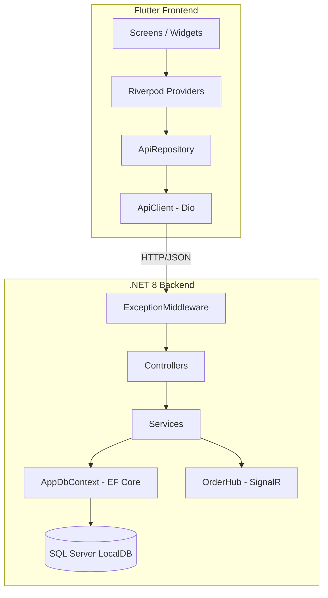

# Brewhaus Backend Analysis & Add Tables Feature

## Architecture Summary



| Layer | Pattern | Files |
|---|---|---|
| **Entry Point** | Minimal hosting (`Program.cs`) | `Program.cs` |
| **Controllers** | REST API (`/api/*`) | `AuthController`, `MenuController`, `OrdersController`, `TablesController` |
| **Services** | Interface-segregated DI | `IAuthService`, `IMenuService`, `IOrderService`, `ITableService`, `IFileService`, `ITokenService`, `IEmailService` |
| **Data** | EF Core Code-First | `AppDbContext` → SQL Server LocalDB |
| **DTOs** | Request/Response + `ApiResponse<T>` wrapper | Single `DTOs.cs` |
| **Models** | Anemic domain entities | Single `Models.cs` |
| **Realtime** | SignalR Hub | `OrderHub` (kitchen + per-order groups) |
| **Cross-cutting** | Global exception middleware, JWT auth, CORS | `ExceptionMiddleware`, `Program.cs` |

---

## Run Instructions

### Backend (.NET 8 API)

```powershell
cd coffee_shop-mangement-API-main

# 1. Restore + Build
dotnet build

# 2. Run (auto-migrates DB on startup via Program.cs line 128-132)
dotnet run
```

- **HTTP**: `http://localhost:53978`
- **HTTPS**: `https://localhost:53977`
- **Swagger**: `https://localhost:53977/swagger`
- **DB**: `(localdb)\MSSQLLocalDB` → `CoffeeShopDB`
- **Seed admin**: `admin@brewhaus.com` / `password`

### Flutter

```powershell
cd ..   # project root
flutter run -d chrome
```

- API base URL configured in [app_config.dart](file:///d:/coffee_shop_app/coffee_shop%20-%20Copy%20-%20Copy%20-%20Copy/lib/utils/app_config.dart) → `http://localhost:53978/api`

---

## Issues Found

### 🔴 Critical

| # | Issue | Location | Impact |
|---|---|---|---|
| 1 | **Order status enum case mismatch** | Flutter sends `completed` (lowercase), backend expects `Completed` (PascalCase) | `GET /orders?status=completed` → **400 Bad Request** |

### 🟡 Medium

| # | Issue | Location | Impact |
|---|---|---|---|
| 2 | **No "Add Table" UI in Flutter** | [tables_screen.dart](file:///d:/coffee_shop_app/coffee_shop%20-%20Copy%20-%20Copy%20-%20Copy/lib/screens/tables_screen.dart) | Tables endpoint returns `[]`, no way for admin to create tables |
| 3 | **No `createTable` / `deleteTable` in ApiRepository** | [api_repository.dart](file:///d:/coffee_shop_app/coffee_shop%20-%20Copy%20-%20Copy%20-%20Copy/lib/data/api_repository.dart) | Backend supports `POST /api/tables` and `DELETE /api/tables/{id}` but Flutter has no methods for them |
| 4 | **Missing `wwwroot` directory** | Backend startup warning | Image uploads will crash (`FileService` references `_env.WebRootPath`) |

### 🟢 Low

| # | Issue | Location | Impact |
|---|---|---|---|
| 5 | `RegisterRequest.Role` defaults to `"Cashier"` in DTO but Model defaults to `"Employee"` | DTOs.cs:42 vs Models.cs:13 | Inconsistent role naming |
| 6 | `dart:io` imported but unused | [api_client.dart:7](file:///d:/coffee_shop_app/coffee_shop%20-%20Copy%20-%20Copy%20-%20Copy/lib/data/api_client.dart#L7) | Analyzer warning |

---

## Proposed Changes

### 1. Fix Order Status Enum Case (Backend)

The backend already has `JsonStringEnumConverter` with `camelCase` policy in `Program.cs:76`. This means enums serialize as **camelCase** in JSON responses. However, model binding for query parameters doesn't use this — it expects **PascalCase**.

> [!IMPORTANT]
> The simplest fix: update Flutter to send PascalCase status values, matching what the backend expects for query-string binding.

#### [MODIFY] [api_repository.dart](file:///d:/coffee_shop_app/coffee_shop%20-%20Copy%20-%20Copy%20-%20Copy/lib/data/api_repository.dart)
- Change `status.name` (camelCase) to capitalized form when sending query params

---

### 2. Add Table CRUD in Flutter (Main Feature)

#### [MODIFY] [api_repository.dart](file:///d:/coffee_shop_app/coffee_shop%20-%20Copy%20-%20Copy%20-%20Copy/lib/data/api_repository.dart)
- Add `createTable(String tableNumber, int capacity)` → `POST /api/tables`
- Add `deleteTable(int id)` → `DELETE /api/tables/{id}`

#### [MODIFY] [table_provider.dart](file:///d:/coffee_shop_app/coffee_shop%20-%20Copy%20-%20Copy%20-%20Copy/lib/providers/table_provider.dart)
- Add `addTable(String name, int seats)` method
- Add `deleteTable(int id)` method

#### [MODIFY] [tables_screen.dart](file:///d:/coffee_shop_app/coffee_shop%20-%20Copy%20-%20Copy%20-%20Copy/lib/screens/tables_screen.dart)
- Add "+" button in the SectionHeader (similar to MenuScreen)
- Add `_AddTableSheet` bottom sheet with fields: Table Number, Capacity
- Add delete action on each table card
- Add `_DeleteTable` confirmation dialog

---

### 3. Create `wwwroot` directory

#### [NEW] `coffee_shop-mangement-API-main/wwwroot/uploads/.gitkeep`
- Ensures the directory exists for image uploads

---

## Verification Plan

### Automated Tests
```powershell
# Backend builds clean
dotnet build

# Flutter analysis passes
flutter analyze
```

### Browser Tests
1. Log in as admin (`admin@brewhaus.com` / `password`)
2. Navigate to Tables screen
3. Click "+ Add Table" → fill form → verify table appears
4. Delete a table → verify it's removed
5. Verify orders screen loads without 400 errors
